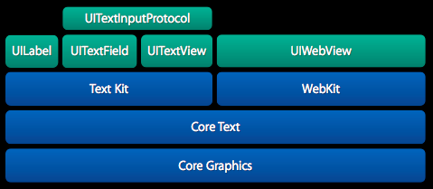
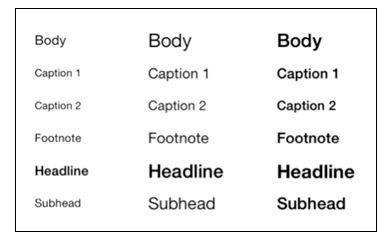

#TextKit 详解

-----

###定义
>Text Kit指的是UIKit框架中用于提供高质量排版服务的一些类和协议，它让程序能够存储，排版和显示文本信息，并支持排版所需要的所有特性，包括字距调整、连写、换行和对齐等。

----
###特性





1. 居于coreText，支持分页文本、文本包装、富文本编辑、交互式文本着色、文本折叠和自定义截取等特性。

2. UITextView，UITextField、UILabel都已经基于Text Kit重新构建

3. textKit 可以做到：


		*动态字体（Dynamic type）
		
		*凸版印刷体效果（Letterpress effects）
		
		*路径排除（Exclusion paths）
		
		*动态文本格式化和存储（Dynamic text formatting and storage）
		
		
		
----		
`下面我们分别分别说说textKit的这4个用法`


###动态字体（Dynamic type）


根据用户在 设置-->通用-->字体大小里面的设置，程序自动调整字体的大小以及样式，当用户调整字体大小时，会向所有的应用发送 UIContentSizeCategoryDidChangeNotification 的通知。

```
self.textView.font = [UIFont preferredFontForTextStyle:UIFontTextStyleBody]; 

[[NSNotificationCenter defaultCenter] addObserver:self 
    selector:@selector(preferredContentSizeChanged:) 
    name:UIContentSizeCategoryDidChangeNotification 
    object:nil]; 
    
-(void)preferredContentSizeChanged:(NSNotification *)notification{ 
    self.textView.font = [UIFont preferredFontForTextStyle:UIFontTextStyleBody];     
}

```
当前支持的字体种类有六中



```
UIFontTextStyleHeadline
UIFontTextStyleBody
UIFontTextStyleSubheadline
UIFontTextStyleFootnote
UIFontTextStyleCaption1
UIFontTextStyleCaption2

```


---


###凸版印刷体效果（Letterpress effects）

为字体加上阴影和高光的效果

```
NSDictionary *attributes = @{  
    NSForegroundColorAttributeName: [UIColor redColor], 
    NSFontAttributeName: [UIFont preferredFontForTextStyle:UIFontTextStyleHeadline], 
    NSTextEffectAttributeName: NSTextEffectLetterpressStyle 
}; 
self.titleLabel.attributedText = [[NSAttributedString alloc] initWithString:@"Title" attributes:attributes];

```

`更多效果，可以查看NSAttributedString 的属性`

---
					
###路径排除（Exclusion paths）

按照给定的路径，在布局文本的时候绕开路径包含的范围

```
UIBezierPath *floatingPath = [self pathOfImage]; 
self.textView.textContainer.exclusionPaths = @[floatingPath]; 

```

`重点理解textView 的textContainer 属性。`


---


###动态文本格式化和存储（Dynamic text formatting and storage）


通过规则实现对文本里面的某些文本给予不一样的格式（字体、颜色等）

---

本博客只是比较粗略的了解了 textKit ，在应用开发中textKit 可以帮助你做更多的事情，让我们边用边


[详细的demo](https://github.com/tracy-e/TextKitDemo) 

#####参考链接

[Apple Doc](https://github.com/tracy-e/TextKitDemo) 

[RayWenderLich](https://github.com/tracy-e/TextKitDemo) 


---
